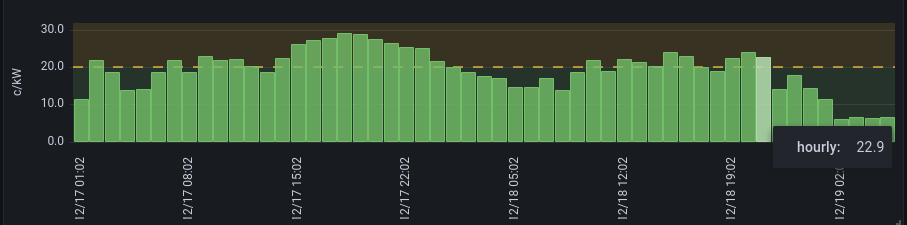

# Electricity Spot Prices to Influxdb

This repos is for tracking electricity price by storing the hourly spot
prices to influxdb for later usage, like creating visualizations or to
use it for home automation to optimize consumption.

This is using [entsoe-py library](https://github.com/EnergieID/entsoe-py) for
fetching the spot prices. This  requires you register for free API key.
Database is fed using
[InfluxDB python library](https://github.com/influxdata/influxdb-client-python).

# Install requirements

To create this env, do e.g.

```
mkdir src; cd src
git clone git@github.com:ikke-t/electricity-spotprice-to-influxdb.git elespot2inf
cd elespot2inf
python3 -m venv virtualenv
source virtualenv/bin/activate
pip install influxdb-client entsoe-py
cp elespot2inf-example.ini elespot2inf.ini
```
and edit your ini file to have entsoe key, and influxdb authentication and url info.

# Grafana view



The example screenshot from grafana is taken using this flux query:

```
from(bucket: "electric")
  |> range(start: v.timeRangeStart, stop: v.timeRangeStop)
  |> filter(fn: (r) => r["_measurement"] == "spotprice")
  |> filter(fn: (r) => r["_field"] == "hourly")
  |> map(fn: (r) => ({r with _value: float(v:r._value) * 1.1 / 10.0}))
  |> aggregateWindow(every: 1h, fn: max, createEmpty: true)
  |> aggregateWindow(every: v.windowPeriod, fn: max, createEmpty: false)
  |> yield(name: "last")
```
Note there is the calculation for adding tax there, and converting the prices from MW to kW.

# Make it run periodicly

Here are systemd example files for running this periodicly. The
[elespot2inf.service](./elespot2inf.service) file defines the service, check
the paths apply to your setup. Then the correspondig
[elespot2inf.timer](./elespot2inf.timer) makes it run every day. Write the
files under your home dir ~/.config/systemd/user, and make systemd aware of them,
and set linger to your user so they keep running after you log out. Here is
example running them as pi user:

```
systemctl --user daemon-reload
systemctl --user enable --now elespot2inf.service
systemctl --user enable --now elespot2inf.timer
sudo loginctl enable-linger pi
```

This keeps feeding the influxdb daily. As of writing I set the timer to
trigger a bit after 13 o'clock and again couple of hours later just
for certainty. There could be some logic added to make sure run succeeds,
and loop until that. Now it's just run twice a day.
